<p align="center">
  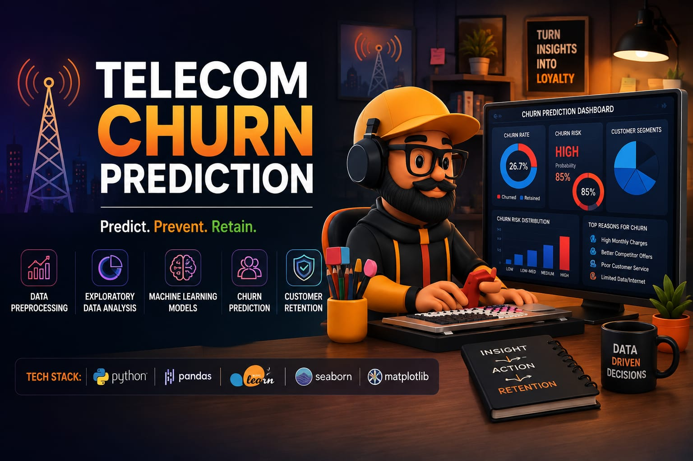
</p>

<h1 align="center">📡 Telecom Customer Churn Prediction</h1>

<p align="center">
An end-to-end Machine Learning system for predicting telecom customer churn, featuring exploratory data analysis, automated preprocessing, model comparison, hyperparameter optimization, FastAPI inference, Streamlit UI, and Docker deployment.
</p>

<p align="center">
  
  
  
  
  
  
  
  
  
  
</p>

---

## 📌 Project Overview

Customer churn is one of the most expensive problems telecom companies face — acquiring a new customer costs significantly more than retaining an existing one. This project builds an **end-to-end machine learning system** that identifies customers who are likely to churn, so retention teams can act before it happens.

The pipeline covers the full ML lifecycle: raw data → EDA → preprocessing → model training → evaluation → hyperparameter tuning → final model selection → API deployment → frontend interface → containerization.

The target variable is `Churn`:

- `Yes` — customer churned
- `No` — customer remains

**Dataset snapshot:**

- 60,000 rows, 25 columns
- ~87% No / ~13% Yes (imbalanced)
- ~900 duplicate rows
- Missing values across multiple columns

---

## 🎯 Objective

The goal is to build a reliable, deployable system that identifies customers at risk of churning — not just a notebook model. Model selection prioritizes **Recall, Precision, F1-score, and ROC-AUC** over raw accuracy, since accuracy is a misleading metric on imbalanced classification problems like this one. The final model is wrapped in a production-style API and UI, and containerized for deployment.

---

## 📊 Dataset

| Property            | Value                    |
| ------------------- | ------------------------ |
| Dataset Size        | 60,000 rows × 25 columns |
| Target              | Churn                    |
| Target Type         | Binary Classification    |
| Classes             | Yes / No                 |
| Class Distribution  | ~87% No / ~13% Yes       |
| Duplicate Rows      | ~900                     |
| Missing Values      | Present                  |
| Customer Identifier | CustomerID                |

**Key features:** `Gender`, `SeniorCitizen`, `Partner`, `Dependents`, `Tenure`, `PhoneService`, `MultipleLines`, `InternetService`, `OnlineSecurity`, `OnlineBackup`, `DeviceProtection`, `TechSupport`, `StreamingTV`, `StreamingMovies`, `Contract`, `PaperlessBilling`, `PaymentMethod`, `MonthlyCharges`, `TotalCharges`, `MonthlyDataUsageGB`, `NumberOfComplaints`, `SatisfactionScore`, `AvgCallDuration`.

---

## 🔎 Exploratory Data Analysis

EDA was performed to understand churn patterns across tenure, contract type, internet service, payment method, charges, complaints, satisfaction, and call behavior, along with feature correlations and outliers.

<p align="center">
  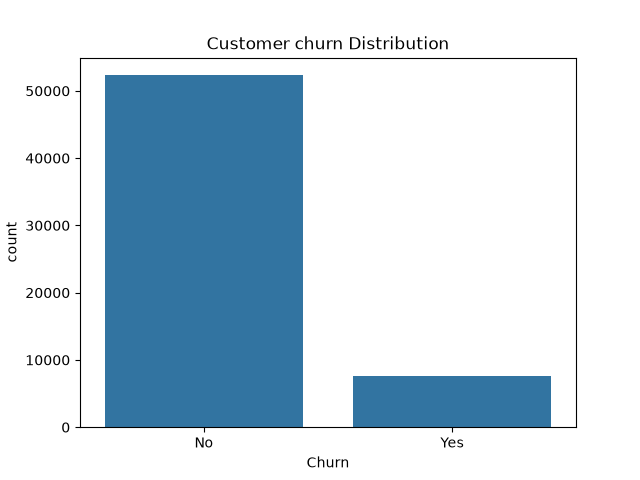
</p>

<p align="center">
  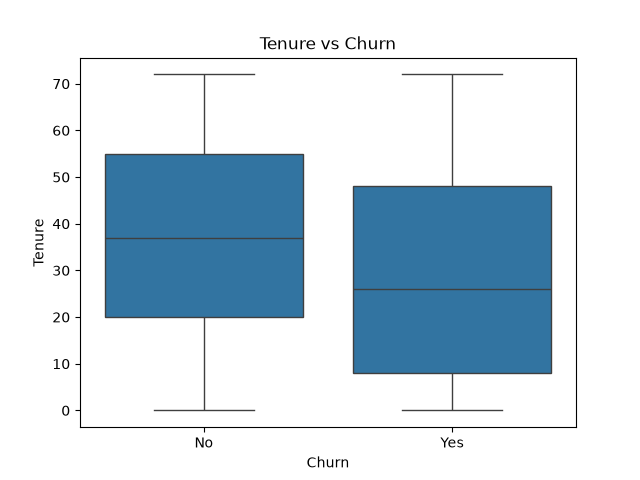
</p>

<p align="center">
  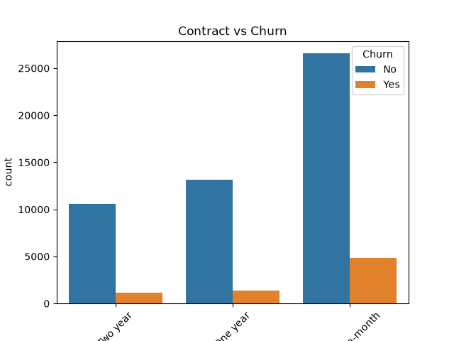
</p>

<p align="center">
  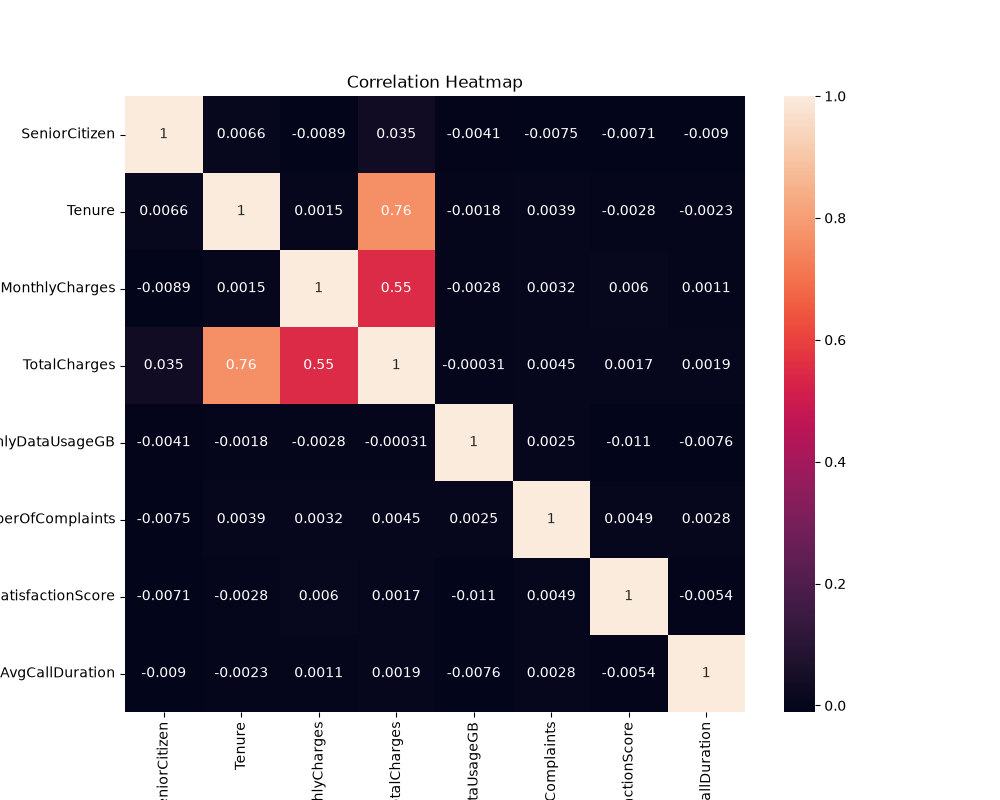
</p>

> Additional EDA visualizations (internet service, payment method, total charges vs. churn, etc.) are available in [`reports/plots/`](reports/plots/).

---

## 🧹 Data Preprocessing

1. Remove duplicate rows
2. Drop `CustomerID` (identifier, not predictive)
3. Separate numerical and categorical features
4. Split data into train/test sets
5. Impute missing numerical values — `SimpleImputer(strategy="mean")`
6. Impute missing categorical values — `SimpleImputer(strategy="most_frequent")`
7. Encode categorical features — `OneHotEncoder(drop="first", handle_unknown="ignore")`
8. Scale numerical features — `StandardScaler`
9. Balance training data — `RandomUnderSampler`
10. Persist preprocessing objects with `Joblib`

Preprocessing artifacts are saved in [`artifacts/`](artifacts/):

- `cat_imputer.pkl`
- `num_imputer.pkl`
- `encoder.pkl`
- `scaler.pkl`

---

## ⚖️ Imbalanced Classification

The raw dataset is heavily imbalanced (~87% No Churn / ~13% Churn). On imbalanced data, a model can score high accuracy while still failing to catch churners — the exact customers the business cares about. To address this, `RandomUnderSampler` was applied to the **training data only**:

| Class     | Count (after undersampling) |
| --------- | ---------------------------: |
| No Churn  | 6,016                         |
| Churn     | 6,016                         |

The test set was left untouched to reflect real-world class distribution during evaluation.

---

## 🤖 Machine Learning Models

Four classification algorithms were trained and compared:

1. Logistic Regression
2. Decision Tree
3. Random Forest
4. Gradient Boosting

| Model               | Accuracy | ROC-AUC |
| -------------------- | -------: | ------: |
| Logistic Regression  |     0.61 |   0.618 |
| Decision Tree        |     0.64 |   0.645 |
| **Random Forest**    | **0.85** | **0.823** |
| Gradient Boosting    |     0.82 |   0.652 |

**Random Forest** emerged as the strongest baseline based on ROC-AUC and overall performance, and was selected for further tuning.

---

## 📈 Model Evaluation

Models were evaluated using Accuracy, Precision, Recall, F1-score, ROC-AUC, and Confusion Matrix — since for churn prediction, correctly identifying churners (recall) and minimizing false alarms (precision) matter more than raw accuracy.

<p align="center">
  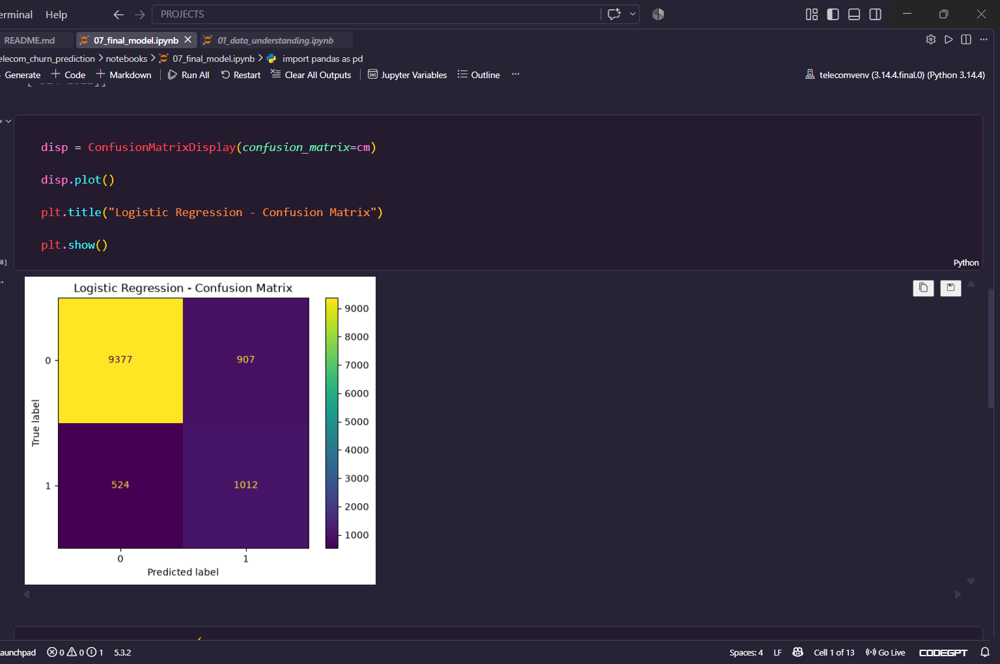
</p>

<p align="center">
  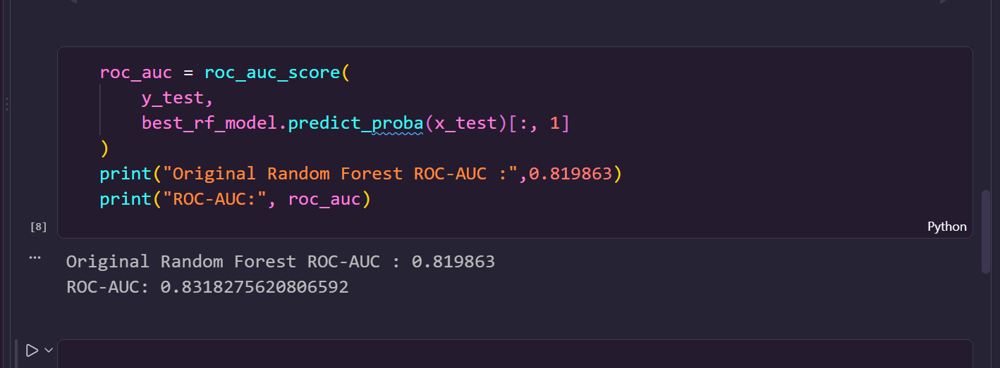
</p>

<p align="center">
  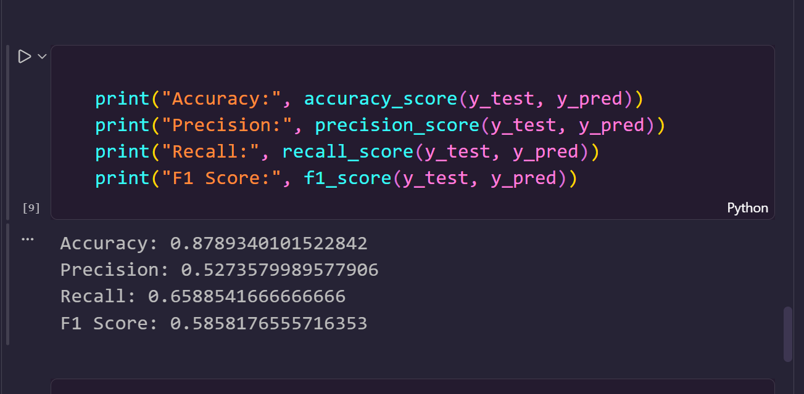
</p>

---

## 🧠 Hyperparameter Tuning

### GridSearchCV

- Best parameters: `max_depth=20`, `n_estimators=300`
- ROC-AUC: **0.817**

### Optuna (50 trials)

- Best parameters: `n_estimators=444`, `max_depth=21`, `min_samples_split=2`, `min_samples_leaf=1`
- Best ROC-AUC: **0.8199**

The tuned model was saved as [`best_rf_model.pkl`](models/best_rf_model.pkl).

---

## 🏆 Final Model

The **Optuna-tuned Random Forest** was selected as the final production model.

**Final test-set performance:**

| Metric    |  Score |
| --------- | -----: |
| Accuracy  |  87.9% |
| Precision |  52.7% |
| Recall    |  65.9% |
| F1-Score  |  58.6% |
| **ROC-AUC** | **83.2%** |

> 🎯 **ROC-AUC: 0.832** and **Recall: 65.9%** are the headline metrics — in a churn prediction system, catching as many at-risk customers as possible is the primary business objective.

<p align="center">
  
</p>

<p align="center">
  
</p>

---

## 🔄 End-to-End ML Pipeline

```text
Raw Data
   ↓
Data Validation
   ↓
EDA
   ↓
Data Cleaning
   ↓
Train/Test Split
   ↓
Imputation
   ↓
Encoding
   ↓
Scaling
   ↓
Class Balancing
   ↓
Model Training
   ↓
Model Evaluation
   ↓
Hyperparameter Tuning
   ↓
Final Random Forest
   ↓
FastAPI
   ↓
Streamlit
   ↓
Docker
```

---

## 🚀 FastAPI Deployment

The final model is served through a FastAPI backend.

| Endpoint      | Method | Description                                  |
| ------------- | ------ | --------------------------------------------- |
| `/`           | GET    | Welcome endpoint                              |
| `/health`     | GET    | Health check endpoint                         |
| `/predict`    | POST   | Accepts customer data and returns a prediction |

**Workflow:** `Customer Input → FastAPI → Preprocessing → Final Model → Prediction`

<p align="center">
  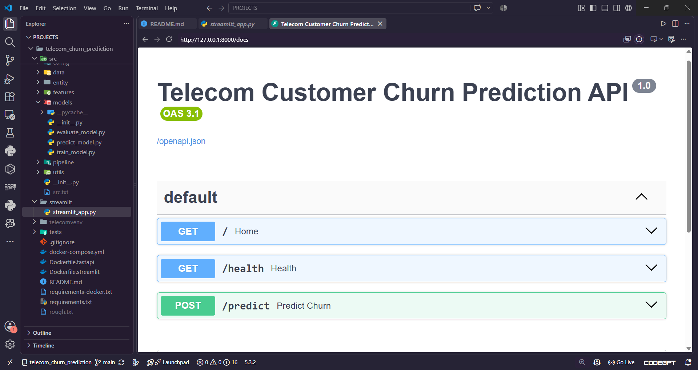
</p>

---

## 🖥️ Streamlit Frontend

A Streamlit app provides a simple interface for entering customer details and viewing the churn prediction — either `Will Churn` or `Will NOT Churn`.

<p align="center">
  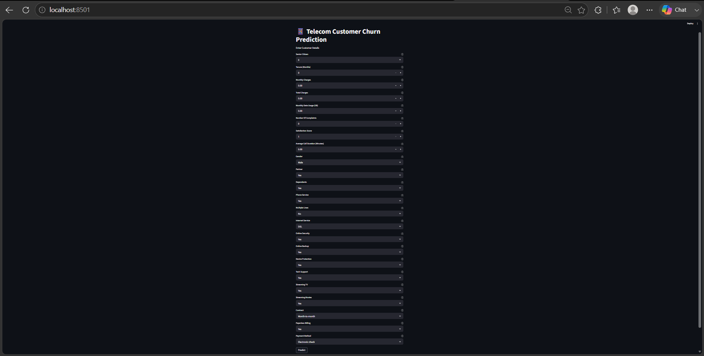
</p>

<p align="center">
  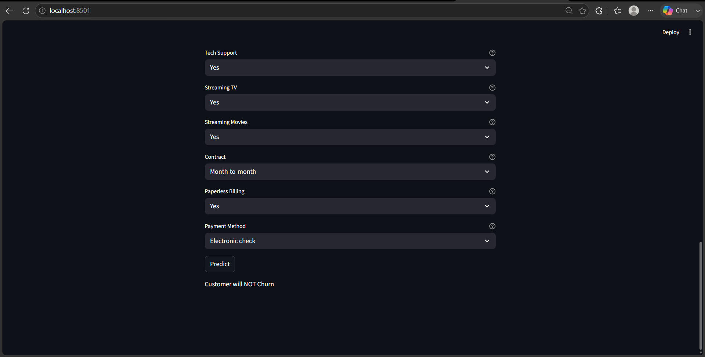
</p>

---

## 🐳 Docker Deployment

The full application is containerized with two services:

| Service            | Port   |
| ------------------- | ------ |
| FastAPI backend      | `8000` |
| Streamlit frontend   | `8501` |

Both services are orchestrated together using **Docker Compose**.

<p align="center">
  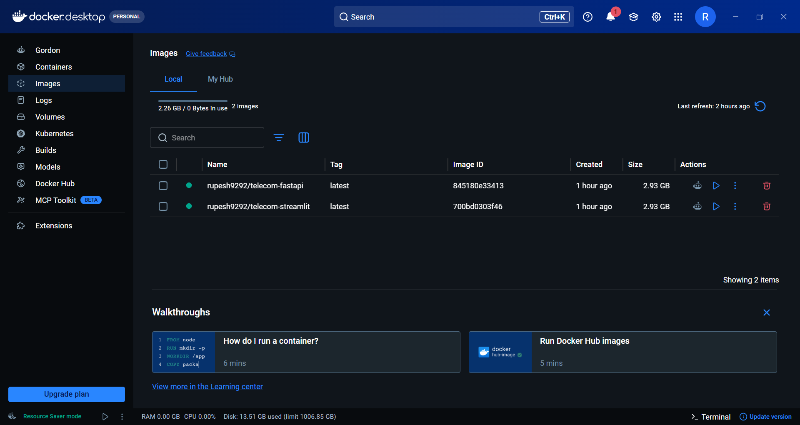
</p>

---

## 📸 Project Screenshots

### 📊 EDA
<p align="center">
  
</p>

### 🤖 Model Evaluation
<p align="center">
  
  <br>
  
</p>

### 🚀 FastAPI
<p align="center">
  
</p>

### 🖥️ Streamlit
<p align="center">
  
  <br>
  
</p>

### 🐳 Docker
<p align="center">
  
</p>

---

## 🗂️ Project Structure

```text
telecom-customer-churn/
│
├── data/
├── notebooks/
├── src/
├── artifacts/
├── models/
├── reports/
├── streamlit/
├── Dockerfile.fastapi
├── Dockerfile.streamlit
├── docker-compose.yml
└── README.md
```

---

## ⚙️ Installation

### Clone the repository

```bash
git clone <repository-url>
cd telecom-customer-churn
```

### Create a virtual environment (Windows)

```bash
python -m venv venv
venv\Scripts\activate
```

### Install dependencies

```bash
pip install -r requirements.txt
```

### Run FastAPI

```bash
uvicorn src.api.app:app --reload
```

### Run Streamlit

```bash
streamlit run streamlit/streamlit_app.py
```

---

## 🐳 Run with Docker

```bash
docker compose up --build
```

Once running:

- **FastAPI:** `http://localhost:8000`
- **FastAPI Swagger Docs:** `http://localhost:8000/docs`
- **Streamlit:** `http://localhost:8501`

---

## 📁 Notebooks

| Notebook                          | Purpose                            |
| ---------------------------------- | ----------------------------------- |
| `01_data_understanding.ipynb`      | Dataset understanding               |
| `02_EDA.ipynb`                     | Exploratory data analysis           |
| `03_data_preprocessing.ipynb`      | Data preprocessing                  |
| `04_model_training.ipynb`          | Model training                      |
| `05_model_evaluation.ipynb`        | Model evaluation                    |
| `06_hyperparameter_tuning.ipynb`   | GridSearchCV + Optuna               |
| `07_final_model.ipynb`             | Final model evaluation and saving   |

---

## 🛠️ Technologies Used

**Programming:** Python

**Data Processing:** Pandas, NumPy

**Machine Learning:** Scikit-learn, Imbalanced-learn

**Hyperparameter Optimization:** GridSearchCV, Optuna

**API:** FastAPI, Uvicorn

**Frontend:** Streamlit

**Deployment:** Docker, Docker Compose

**Model Serialization:** Joblib

---

## 📌 Key Learnings

- Handling missing values in real-world datasets
- Handling class imbalance with undersampling techniques
- Feature encoding and scaling strategies
- Comparing multiple classification algorithms
- Hyperparameter optimization with GridSearchCV and Optuna
- Evaluating models beyond accuracy (Precision, Recall, F1, ROC-AUC)
- Saving and versioning preprocessing artifacts
- Building a reproducible prediction pipeline
- Serving ML models through a FastAPI backend
- Building an interactive ML frontend with Streamlit
- Containerizing multi-service ML applications with Docker

---

## 🔮 Future Improvements

- Explore SMOTE or other advanced imbalance-handling techniques
- Experiment with XGBoost / LightGBM
- Add SHAP-based model explainability
- Return prediction probability/confidence scores
- Add model monitoring in production
- Set up CI/CD for automated testing and deployment
- Deploy to a cloud platform (AWS / GCP / Azure)
- Add an automated retraining pipeline
- Add authentication to the API

---

## 👨‍💻 Author

**Rupesh Mane**
*Machine Learning Engineer*

- GitHub: `github.com/Rupesh-Mane`
- LinkedIn: `linkedin.com/in/rupeshmane10`
- Email: `manerupesh317@gmail.com`

---

<p align="center">⭐ If you found this project useful, consider giving it a star!</p>
